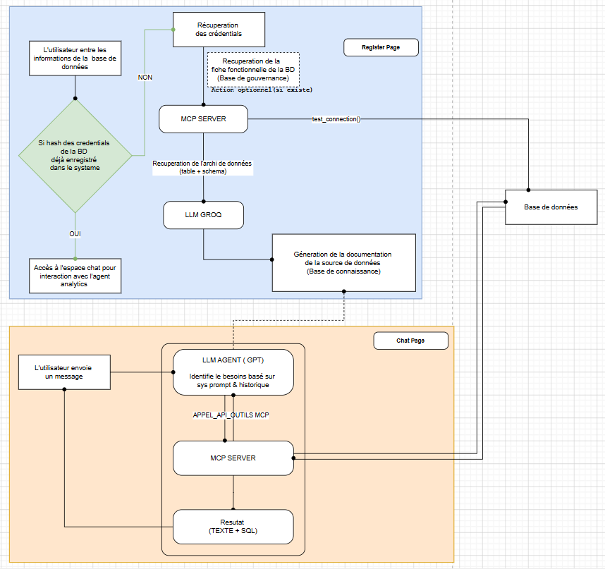

# texttosql-mcp-agentic
## Home Page

## Architecture Fonctionnel

## Architecture du code 
<pre>
mcp-agentic-analytics/
│
├── server/                          # MCP Server
│   ├── main.py
│   ├── session.py
│   ├── connectors/
│   │   ├── base.py
│   │   ├── postgresql.py
│   │   ├── mysql.py
│   │   └── excel_csv.py
│   └── tools/
│       ├── schema_tools.py
│       └── query_tools.py
│
├── client/
│   ├── web/                         # Client Web Flask
│   │   ├── app.py
│   │   ├── config.py
│   │   ├── core/
│   │   │   ├── __init__.py
│   │   │   ├── mcp_client.py        # execute_tool, load_mcp_tools
│   │   │   ├── agent.py             # run_agent, agentic loop
│   │   │   └── session_store.py     # USER_SESSIONS (→ Redis ready)
│   │   ├── routes/
│   │   │   ├── __init__.py
│   │   │   ├── home.py
│   │   │   ├── register.py
│   │   │   └── chat.py
│   │   ├── templates/
│   │   │   ├── home.html
│   │   │   ├── register.html
│   │   │   └── chat.html
│   │   └── static/
│   │
│   └── cli/                         # Client CLI
│       └── main.py
│
├── shared/                          # Partagé web + CLI
│   ├── __init__.py
│   ├── prompt_generator.py          # SystemPromptGenerator
│   └── prompts/                     # .txt par db_type
│       ├── postgresql.txt
│       ├── mysql.txt
│       ├── excel.txt
│       ├── csv.txt
│       └── demo.txt
│
├── logs/
├── .env
└── requirements.txt
</pre>